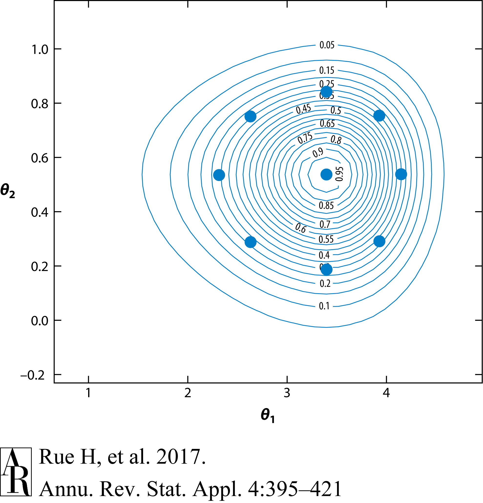

```{r, echo=FALSE, message=FALSE, warning=FALSE}
library(here)
library(tidyverse)

basketball_teams <- read_csv(here("teams_nba.csv"))
basketball_games <- read_csv(here("games.csv")) %>% 
    filter(str_starts(GAME_DATE_EST, "2018")) %>% 
    select(HOME_TEAM_ID, VISITOR_TEAM_ID, HOME_TEAM_WINS) %>% 
    mutate(HOME_TEAM_ID = basketball_teams$NICKNAME[match(HOME_TEAM_ID, basketball_teams$TEAM_ID)],
           VISITOR_TEAM_ID = basketball_teams$NICKNAME[match(VISITOR_TEAM_ID, basketball_teams$TEAM_ID)]) %>% 
    mutate(VISITOR_TEAM_WINS = 1 - HOME_TEAM_WINS) %>%
    drop_na()

teams <- sort(unique(c(basketball_games$HOME_TEAM_ID, basketball_games$VISITOR_TEAM_ID)))

get_data_vec <- function(home_team, away_team, teams) {
  vec <- rep(0, length(teams))
  vec[teams == home_team] <- 1
  vec[teams == away_team] <- -1
  vec
}

X <- apply(basketball_games, 1, 
           function(row) get_data_vec(row["HOME_TEAM_ID"], 
                                      row["VISITOR_TEAM_ID"], 
                                      teams))
X <- t(X)

y <- as.numeric(basketball_games$HOME_TEAM_WINS)
bt_df <- as.data.frame(cbind(y, X))
colnames(bt_df) <- c("y", "Seventy_Sixers", "Bucks", "Bulls", "Cavaliers", "Celtics", "Clippers", "Grizzlies", "Hawks", "Heat", "Hornets", "Jazz", "Kings", "Knicks", "Lakers", "Magic", "Mavericks", "Nets", "Nuggets", "Pacers", "Pelicans", "Pistons", "Raptors", "Rockets", "Spurs", "Suns", "Thunder", "Timberwolves", "Trail_Blazers", "Warriors", "Wizards")
```

# Theoretical Background
## Bayesian inference

In Bayesian statistics, all unknown quantities of a model are treated as random variables. The overall aim is to compute the
joint posterior distribution of these parameters $\theta$ given the observed data $X = \{x_1, ..., x_n\}$.

This relies on Bayes Theorem:

$$\pi(\theta \mid X) = \frac{\pi(X \mid \theta)\pi(\theta)}{\pi(X)}$$

Where $\pi(X \mid \theta)$ is the likelihood of the data given the parameters, $\pi(\theta)$ is
the prior distribution of the parameters and $\pi(X)$ is the marginal likelihood, acting mostly as
a normalising constant.

Summary statistics for $\theta_{i} \in \theta$ can be obtained using the joint posterior distribution for $\theta$, $\pi(\theta \mid X)$,
as well as from the posterior marginal distribution of $\theta_{i}$, $\pi(\theta_{i} \mid X)$; this can be obtained by integrating the
other parameters out of the posterior joint distribution.

### Conjugate analysis

Closed forms for these posterior distributions are only available for some models. For example, if the prior and likelihood
are both Gaussian, then the posterior distribution will also be Gaussian.

This leaves a large number of models for which the posterior is not available in closed form. In these cases, we must
turn to numerical methods to approximate this.

### Numerical methods

Numerical methods in general are used to estimate the various integrals in Bayesian models, for example the posterior
mean of a parameter $\theta_{i}$ can be estimated by:

$$\mathbb{E}(\theta_{i} \mid X) = \int \theta_{i} \pi(\theta_{i} \mid X) d\theta_{i}$$

Where $\pi(\theta_{i} \mid X)$ is the posterior marginal distribution of $\theta_{i}$.

The most common algorithm is Markov Chain Monte Carlo (MCMC), this attempts to converge to the joint posterior
distribution in order to obtain samples from it; these can then be used to estimate summary statistics.
It is a powerful technique, but can be slow to converge and has performance issues with high dimensional models 
and hierarchical models. This is where Integrated Nested Laplace Approximation (INLA) comes in.

## Integrated Nested Laplace Approximation

INLA is a deterministic method for directly estimating the posterior marginal distribution of a parameter $\pi(\theta_{i} \mid X)$, 
rather than the joint posterior distribution $\pi(\theta \mid X)$, often doing this faster and with more accuracy than MCMC.

This comes at the cost of only being able to use INLA for Latent Gaussian Models (LGMs), which turns out
to be a large class of commonly used models.

### Latent Gaussian Models

This is a class of models that encapsulates a range of models including generalised linear models (GLMs), 
generalised additive models (GAMs), spatial models and survival models. For our use-case we will be focusing on the 
GLMs, as our performance ranking algorithm - the Bradley-Terry model - can be fit using a GLM. 

#### Definition:

An LGM is a three level hierarchical model, with the first level being the data (likelihood), the second level being the latent field, and the third level being the parameters.
The observations, $y$ are assumed to be conditionally independent given the latent Gaussian field $X$ and parameters $\theta_1$.

$$y \mid X, \theta_1 \sim \prod_{i \in I}^{} f(y_{i} \mid x_{i}, \theta_1)$$

The adaptivity of the model comes from the definition of the latent Gaussian field:

$$X \mid \theta_2 \sim \mathcal{N}(\mu(\theta_2), Q(\theta_2))$$

Where $\mu(\theta_2)$ is the mean vector and $Q(\theta_2)$ is the precision matrix, both of which are functions of the parameters $\theta_2$.
The hyperparameters $\theta = (\theta_1, \theta_2)$ control the latent Gaussian field and the likelihood of the data.

But what does this actually mean, and how does it link to GLMs?

#### Links to other models:

The classical multiple linear regression model can be parameterised as the mean $\mu$ of an n-dimensional observations vector $y$, given by:

$$\mu_i = \alpha + \sum_{j=1}^{n_{\beta}} \beta_j z_{ij}$$
$$\beta = (\beta_1, ...,\beta_{n_\beta})$$

Where $\alpha$ is the intercept, $\beta_j$ is the linear coefficient for the $j^{th}$ covariate and $z_{ij}$ is the $j^{th}$ covariate for the $i^{th}$ observation.
It can be seen as an LGM if we assume Gaussian priors for the parameters $\alpha$ and $\beta_j$ and the model parameters are independent (as we usually do). The
latent field $X = (\alpha, \beta)$ then has a joint Gaussian distribution, and with a tiny noise term in the model definition is nonsingular, so is an LGM in the
hierarchical formulation (although a very simple one).

\newpage
The mean $\mu$ linked to a linear predictor $\eta_i$ yields the GLM setup:

$$\eta_i = g(\mu_i) = g(\alpha + \sum_{j=1}^{n_{\beta}} \beta_j z_{ij})$$
$$\eta = (\eta_1, ..., \eta_{n})$$

Where $g$ is the link function. The linear predictor is additive and can be simply added to the latent field to make $X = (\alpha, \beta, \eta)$, which is still
Gaussian so forms an LGM. A similar formulation is available for GAMs, where the linear predictor is replaced by a sum of non-linear smooth functions.

Extending this to mixed models, those including GLMs, GAMs, and other non-linear models, we can write the linear predictor as:

$$\eta_i = g(\mu_i) = g(\alpha + \sum_{j=1}^{n_{\beta}} \beta_j z_{ij} + \sum_{k=1}^{n_{f}} f_{k}(c_{ik}) + \epsilon_i)$$

Where $f_{k}$ is the $k^{th}$ non-linear smooth effect for covariate $c_{ik}$, and $\epsilon_i$ is the random effect for the $i^{th}$ observation. This is still
an LGM, as the linear predictor is still additive and random effects $\{f_k\}$ are assumed to be Gaussian processes so latent field $X = (\alpha, \beta, \eta, \{f_k\})$
is still Gaussian.

$f_k$ can be something very simple like a Gaussian random effect, but can also include some very complex processes like autoregressive time-series models, spline
models, and spacial models. You can see how the LGM framework is very flexible and can be used to model a wide range of scenarios.

#### Gaussian Markov Random Fields (GMRFs) and Complexity:

In practice, we also assume the latent field $X$ is a (sparse) GMRF, which is a latent Gaussian field where $x_i$ and $x_j$ are conditionally independent given the
remaining elements $x_{-ij}$ of the field (for a decent amount of $\{i, j\}$s). This is a very useful property, as it means the precision matrix $Q$ is sparse, and so is much easier to work with.
The structure of the GMRF is a graph, where each node represents an element of the latent field, and each edge represents a conditional dependence between the
two nodes.

An autoregressive model is probably the most intuitive example of a GMRF, where the latent field is a time-series and each observation is dependent on the previous
observation. This property means that the precision matrix $Q$ is tridiagonal, and can be factorised in $\mathcal{O}(n)$ time, rather than $\mathcal{O}(n^3)$ time
for a general dense matrix. Memory usage is also reduced from $\mathcal{O}(n^2)$ to $\mathcal{O}(n)$.

For models with a spacial structure, the time complexity is $\mathcal{O}(n^{3/2})$ and memory complexity is $\mathcal{O}(n \log{n})$.
You can see that the precision matrix need not be completely sparse, but can still be far more efficient than a general dense matrix.

### Laplacian Approximation

Before we can move on to the INLA algorithm, we need to introduce the Laplacian approximation, which a technique for approximating integrals of the form:

$$I_n = \int_x \exp(n f(x)) dx$$

As $n \rightarrow \infty$, this integral is dominated by the maximum of $f(x)$, so we can approximate it by:

$$I_n \approx \int_x \exp \left(n \left(f(x_0) + \frac{1}{2} (x - x_0)^2 f^{''}(x_0) \right) \right) dx$$
$$= \exp(n f(x_0)) \int_x \exp \left(\frac{1}{2} (x - x_0)^2 f^{''}(x_0)\right) dx$$

Where $x_0$ is the maximum of $f(x)$. This is a Gaussian integral, and can be solved analytically to give:

$$I_n \approx \exp(n f(x_0)) \sqrt{\frac{2 \pi}{-n f^{''}(x_0)}}$$

This approximates the function with a Gaussian, matching the mode and curvature at the mode. This can be used to directly approximate the posterior marginals,
and was used historically before MCMC was popularised. However, it is far more powerful when applied in the INLA algorithm as we can break down the GMRFs into 
integrals we need to estimate that are closer to the Gaussian function.

# Algorithmic Implementation

This explanation will be with regards to GLMs, as it is the most relevant to our use-case.
We can break the problem into three steps, and working backwards from the posterior marginals $\pi(x_i \mid     y)$ (Step 3), list them in descending order:

$$\pi(x_i \mid y) = \int \pi(x_i \mid \theta, y) \pi(\theta \mid y) dx$$ 

 - Approximate $\pi(x_i, \mid \theta, y)$ for a subset of $i = 1, ..., n$, which can be large (Step 2).

 - Approximate $\pi(\theta \mid y)$, which means we must approximate it using some sort of Gaussian approximation (Step 1).

## Step 1: Approximating the posterior marginals $\pi(\theta \mid y)$

Whilst we cannot directly approximate the marginals, as the target is not close to a Gaussian, we can instead approximate:

$$\pi(\theta \mid y) \propto \frac{\pi(\theta) \pi(x \mid \theta) \pi(y \mid x, \theta)}{\pi(x \mid \theta, y)}$$

The laplace approximation takes a Gaussian approximation of the denominator:

$$\begin{split} 
\pi(x \mid \theta, y) \propto \exp \left(-\frac{1}{2} x^T Q(\theta)x + \sum_{i} \log \pi(y_i \mid x_i, \theta) \right) \\
= (2 \pi)^{-n/2} |P(\theta)|^{1/2} \exp \left(-\frac{1}{2} (x - \mu(\theta))^T P(\theta)(x - \mu(\theta)) \right)
\end{split}$$

Where $P(\theta) = Q(\theta) + diag(c(\theta))$, and $\mu(\theta)$ is the location of the mode. The vector $c(\theta)$ is a vector of 
negative second derivatives of the log-likelihood at the mode w.r.t. $x_i$.

This works because it is a GMRF with the same graph structure as the model without observations y, so it doesn't cost much computationally.
The approximation is likely to be accurate because the conditioning on the observations is only on the diagonal; it will only shift the mean,
reduce the variance, and introduce slight skewness.

\newpage
## Step 2: Approximating $\pi(x_i \mid \theta, y)$

This is the most computationally expensive step, as we must approximate the posterior marginals for each $i = 1, ..., n$. This means that
we cannot create perfect Gaussian approximations, as that could create a huge overhead cost for large $n$.

The normal approach used in INLA is to compute a taylor expansion around the mode of the laplace approximation, using a technique called 
simplified Laplace approximation, to add a linear and cubic correction term to the Gaussian approximation:

$$\log \pi(x_i \mid \theta, y) \approx -\frac{1}{2} x_i^2 + b_i(\theta)x_i + \frac{1}{6}c_i(\theta)x_i^3$$

And then matching a skew-normal distribution to this, such that the linear term is a correction for the mean and the cubic term is a correction
for skewness. Meaning that the overall approximation for the posterior marginals $\pi(x_i \mid y)$ is a mixture of skew-normal distributions.

## Step 3: Approximating $\pi(x_i \mid y)$

This is the final step, and the only challenge left is integrating over $\pi(\theta \mid y)$, as standard numerical integration is exponential 
in the dimension of $\theta$. 

The current solution uses integration points on a sphere around the centre, illustrated in the figure below for a 2D case:



This balances the accuracy of the approximation with the computational cost, and is the current default used in R-INLA.

\newpage
# Application to Paired Comparison Models

## The Bradley-Terry Model

The Bradley-Terry Model is a model for predicting the outcome of a paired comparison. Suppose we have $K$ teams competing against each other,
the model assigns team $i$ a latent strength $\lambda_i$, and the probability of team $i$ beating team $j$ is given by:

$$P(i \text{ beats } j) = \frac{\lambda_i}{\lambda_i + \lambda_j}$$

The model assumes the Independence of Irrelevant Alternatives (IIA) property, which means that the probability of $i$ beating $j$ is not dependent
on the presence or absence of other teams. This is a very strong assumption, but allows the construction of a (reasonable) GMRF for the latent strengths $\lambda_i$.
Note the model implies either i beats j or j beats i, there are no draws. 

If we parameterise the strengths as $\lambda_i = \exp(\beta_i)$, then the previous model is equivalent to:

$$\begin{split}
logit (P(i \text{ beats } j)) = \log \left(\frac{P(i \text{ beats } j)}{P(j \text{ beats } i)}\right) \\
= \log \left(\frac{\lambda_i}{\lambda_j}\right) = \beta_i - \beta_j
\end{split}$$

Hence, we can fit the model as a standard logistic regression, which fits very easily into the LGM framework.
An advantage of using the Bradley-Terry model is that it is very easy to take home advantage into account, this is done by 
adding an intercept term to the model.

$$logit (P(i \text{ beats } j)) = \alpha + \beta_i - \beta_j$$

## Implementation using R-INLA

The R-INLA package has a central function `inla()` which works similarly to the `glm()` function, it takes a formula with fixed effects and Gaussian random effects,
a dataframe, and a family with a link function. It then fits the model using the INLA algorithm, and returns a list of results.

The data used below is from the 2018 NBA season.

```{r}
# library(INLA)

# Specify the formula
f <- as.formula(paste0("y ~ ", # Response first
                          paste(colnames(bt_df)[2:length(colnames(bt_df))], 
                          collapse = " + ")
))

# Bradley-Terry model in INLA
#inla_model <- inla(f, data = bt_df, family = "binomial")
#summary(inla_model)
```

The model fits quickly and the results show the posterior means for the strengths of each team, as well as the home advantage term. 
The posterior marginals for each parameter are also available, and can be used in forwards prediction to predict the outcomes of future
games as well as be sampled from.

Here is a comparison of the posterior estimates for the strengths of each team, along with their respective win-rates:
    
```{r, echo=FALSE, message=FALSE, warning=FALSE, fig.cap="Bradley-Terry beta vs. Win %", fig.height=4}
# Bradley-Terry model with home advantage
bt_mod <- glm(y ~ ., data = bt_df, family = binomial())

# Compare BT coefficients with overall win percentage
coef_df <- data.frame(
  team = bt_df %>% select(-y) %>% colnames() %>% as.character(),
  beta = c(summary(bt_mod)$coefficients[2:length(teams), "Estimate"], 0)
)

# get team win percentages
home_df <- basketball_games %>% group_by(HOME_TEAM_ID) %>%
  summarize(home_win  = sum(HOME_TEAM_WINS),
            home_loss = sum(!HOME_TEAM_WINS))
away_df <- basketball_games %>% group_by(VISITOR_TEAM_ID) %>%
  summarize(away_win  = sum(VISITOR_TEAM_WINS),
            away_loss = sum(!VISITOR_TEAM_WINS))
win_pct_df <- inner_join(home_df, away_df, 
                         by = c("HOME_TEAM_ID" = "VISITOR_TEAM_ID")) %>%
  transmute(team = HOME_TEAM_ID,
            win = home_win + away_win,
            loss = home_loss + away_loss) %>%
  mutate(win_pct = win / (win + loss)) %>%
  arrange(desc(win_pct))

library(ggrepel)

win_pct_df %>% inner_join(coef_df) %>%
    ggplot(aes(x = win_pct, y = beta)) +
    geom_point() +
    geom_text_repel(aes(label = team)) +
    labs(x = "Win percentage", y = "Bradley-Terry beta",
        title = "Bradley-Terry beta vs. Win %") + 
    geom_smooth(method = "lm", se = TRUE) + 
    scale_x_continuous(breaks = seq(0, 1, 0.1), limits = c(0, 1))
```

You can see that the strength estimates are highly correlated with the win percentages, but there are some differences. This is because the Bradley-Terry model
is a relative model, so the strengths are only defined up to a constant. This means that the strengths are only meaningful in comparison to each other, and not
in isolation.

## Comparison to MCMC

We fit a similar model with MCMC, using the `rstan` package. Here are their respective runtimes for varying numbers of teams:

```{r, echo=FALSE, message=FALSE, warning=FALSE, fig.cap="INLA vs. MCMC runtime", fig.height=4}
# Compare INLA and MCMC runtimes
library(rstan)
library(microbenchmark)

# INLA runtime
inla_runtime <- microbenchmark(
  inla(f, data = bt_df, family = "binomial"),
  times = 10
)

# MCMC runtime
mcmc_runtime <- microbenchmark(
  stan_glm(f, data = bt_df, family = "binomial", chains = 1),
  times = 10
)

# Plot runtimes
library(reshape2)

runtime_df <- data.frame(
  n_teams = c(5, 10, 15, 20, 25, 30),
  inla = inla_runtime$time,
  mcmc = mcmc_runtime$time
) %>% melt(id.vars = "n_teams")

ggplot(runtime_df, aes(x = n_teams, y = value, color = variable)) +
  geom_line() +
  geom_point() +
  labs(x = "Number of teams", y = "Runtime (s)",
       title = "INLA vs. MCMC runtime") +
  scale_color_discrete(name = "Method")
```